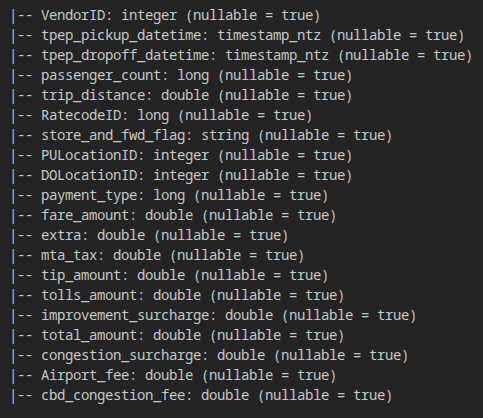
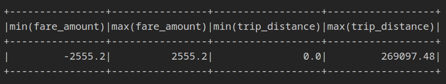
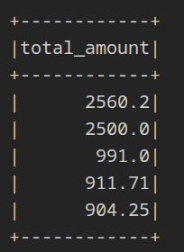
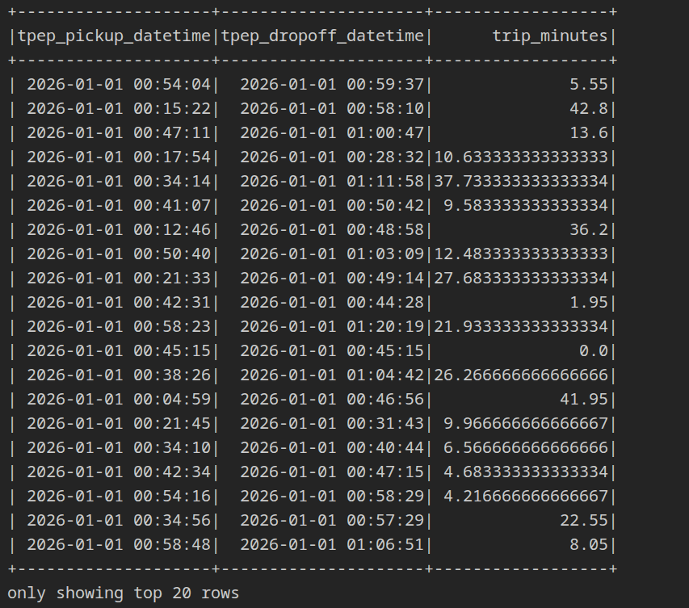

+++
title = "An Overview of Apache Spark"
date = 2026-10-08
draft = false
description = "A beginner-friendly overview of Apache Spark: what it is, how it works under the hood."
tags = ["spark", "pyspark", "data-engineering"]

[cover]
image = "thumbnail.jpeg"
alt = "Apache Spark"
+++

## What is Apache Spark?

Apache Spark is an open source engine used for processing large scale datasets efficiently by distributing the processes in parallel. Spark started in 2009 at UC Berkeley's AMPLab. Later, it became part of the Apache Software Foundation. It is based on Scala and works on a JVM (Java Virtual Machine), but it has different APIs for different languages like Python, Java, SQL, and several others.

## What problem does it solve?

In the late 2000s, data over the internet started to grow substantially. It went from megabytes to gigabytes and petabytes. With growth of data, the need for storing and processing the data also increased. At that time, the only thing that could handle such large scale data was Apache Hadoop. Hadoop had a similar purpose: to analyze and process large datasets efficiently on fewer compute resources. But there was one bottleneck with Hadoop. For example, there is a dataset of 1 terabyte and we need to filter it. Hadoop would process that data in chunks and every process would read and write the data on the disk for every chunk. Because of that, the disk IO operations would increase a lot and the process time increased. Then Spark got introduced in 2009 for tackling the same problem of processing huge datasets. Spark used to process the data in a similar way Hadoop did, but rather than performing the disk IO operations for every chunk of data, it would store just the result in a shuffle file on the disk, making it more efficient.

## Why Spark?

We can process the data using NumPy or other similar tools like pandas or Polars, but why do we need to use Spark?

Let's say we have data of one petabyte. What NumPy or pandas does is load all the data in some format into the main memory for processing it. We usually don't have that much main memory in systems, so we can't use these technologies for data at this scale. The reason we need Spark here is that it allows processing of huge datasets on low resources.

## How does Spark work under the hood?

Spark is an engine processing data in its own way. To understand how Spark works, we will have to understand a few things related to it:

- **Parquet:** Parquet is a file format which stores data in columns, unlike row-based file formats such as CSV, which store the data in rows. It allows us to process and read only the data that is needed.
- **DataFrame:** A DataFrame is the Spark representation of data. It is basically a table with named and typed columns. It is immutable and it is just the plan; the actions are performed on the actual data.
- **Partition:** The chunk of data (128 MB by default) that is processed at once. Multiple partitions are processed in parallel on multiple CPU cores, allowing parallel processing.
- **Driver:** The driver is the main process that manages all the processing. It is responsible for requesting executors from the cluster manager, making partitions, and managing the results.
- **Executor:** The executor is the process that will run the required tasks on the partitions and hold any data needed for that partition's processing. It will give back the result for only one partition.
- **Cluster:** The machine that has access to all the compute resources. We use it to check if there are any executors available and assign partitions and processes to them.
- **Task:** A task is an operation that is being performed on a partition.
- **Stage:** A stage is a group of tasks that don't need to shuffle data between the partitions. Shuffles are the boundaries of stages.
- **Shuffle:** The data that needs to be moved between partitions so that related data becomes joined together. This is an expensive operation because it needs to perform disk operations for the data to be shuffled.

Here we will take the help of an analogy to better understand the concepts related to Spark.

Let's say we have 1000 books and we want to know how many words are written by each of the authors in those books combined.

- Those books are placed on a shelf (**storage**).
- We have 100 workers (**executors**) to count the books. Every worker can count one book (**partition**) at a time, so the task will be completed in 10 rounds.
- Those workers are working inside a warehouse (**cluster**), and that warehouse has a manager (**cluster manager**) which tells how many workers are available to do the task.
- There is a tasks manager (**driver**) which plans the overall procedure and produces the final results from the executors.

Nobody starts the work until the instructions and the plan to carry out the instructions have been finalized (**lazy evaluation**).

Once the workers start counting the books, they keep track of words for each author with themselves without sharing with anyone. At the end we need the full count of words for every author, but currently the workers will keep the word count for the books they are reading.

At the end, every worker shares their final results and the number of words for every author is added (**shuffle**). Finally, the results are returned to the tasks manager (**driver**), which stores the result.

## Spark Environment

Spark provides multiple built-in libraries and packages for specific workloads. They are built on top of the Spark engine.

- **Spark SQL & DataFrames:** Used for processing structured data. It can take inputs in CSV, Parquet, or JSON and provides a tables API for processing data.
- **Structured Streaming:** Used for processing a stream of data. Spark treats the stream as a table that is growing continuously and processes it in micro-batches.
- **MLlib:** Used for machine learning algorithms. It provides pipelines that chain processing and model steps.
- **GraphX:** Used for analysis of graph data such as social networks.
- **PySpark:** The Python API for Spark. It allows writing applications that use Spark without the need for Scala or Java.

## Hands-on with PySpark

Here I will be using PySpark to demonstrate the different functionalities of Spark and PySpark specifically. I will be using the NYC yellow taxi data for one month. Everything will be running locally on my laptop, so there will be just one machine rather than a cluster.

### Setup

First of all, you will need to install the PySpark package in Python.

If you want to install it globally, run the command directly:

```bash
pip install pyspark
```

Or if you want it in a virtual environment, you can do:

```bash
python -m venv spark-env
source spark-env/bin/activate      # on Windows: spark-env\Scripts\activate
pip install pyspark
```

You will also need to have Java installed on your system, which you can check with:

```bash
java -version
```

### Starting Spark

Here, let's take a look at a basic Python code to filter and process the NYC taxi data of one month.

```python
from pyspark.sql import SparkSession
from pyspark.sql import functions as F

spark = SparkSession.builder.master("local[*]").getOrCreate()
print("Spark UI:", spark.sparkContext.uiWebUrl)
```

We will be starting our code with these lines. Here, the Spark session is the thing that connects the driver to the Spark Java engine. The `"local[*]"` setting means everything will be running on my local machine. `getOrCreate()` will get the existing session or build a new one.

We will be using functions provided by PySpark to perform different types of analysis, like aggregate and sum, on the DataFrame.

We are printing the Spark UI web URL in case you want to look at the stages or processes that Spark has created.

### Loading the data

```python
df = spark.read.parquet("yellow_tripdata_2026-01.parquet")
```

In the next line, we have the `read.parquet()` function, which will read the Parquet file and convert it into a Spark DataFrame for building the plan on top of it.

```python
df.printSchema()
df.show(5)
```


The `printSchema()` function prints the DataFrame's named and typed columns, and `df.show(5)` will print the first 5 rows in the DataFrame.


The schema output is given below:    


### Aggregating with `agg`

```python
df.agg(
   F.min("fare_amount"),
   F.max("fare_amount"),
   F.min("trip_distance"),
   F.max("trip_distance")
).show()
```


As the data is split into partitions, we can't directly apply min, max, or similar functions on the data. Therefore, we need `agg()`, which is short for aggregate, to perform the operations over all the partitions and combine the partial results into one final result. All the functions provided by `F` need to have the column name in `""`.



### Sorting with `orderBy`

We can use `orderBy` to sort the data by a specific column. For example:

```python
df.orderBy("total_amount",ascending=False).show(5)
```



This line will sort the data by `total_amount`. By default it sorts in ascending order, but we can use `ascending=False` to make it sort in descending order. It will show the 5 trips with the highest total amount paid.

### Filtering with `filter`

We can use `filter` to filter the data by some specific condition.

```python
print(df.filter(df.passenger_count > 2).count())
```

Output:

```text
Trips with more than 2 passengers: 136680

```
For example, here in this code it will show the total trips with more than 2 passengers.

We can also combine multiple conditions inside the filter:

```python
df = df.filter((df.fare_amount > 0) & (df.passenger_count > 0) & (df.trip_distance > 0))
```

Mostly it is used for cleaning of data. Like in this code, it will filter out all the entries with no passengers, no distance, or no fare.

### Creating new columns with `withColumn`

We can perform calculations on the existing data and create a new column using it. For example:

```python
df = df.withColumn("trip_minutes",(F.unix_timestamp("tpep_dropoff_datetime") - F.unix_timestamp("tpep_pickup_datetime"))/60)
```


This code will add a new column, `trip_minutes`, where it will calculate the total time and store the trip time in minutes. The `unix_timestamp` function will convert the given time to a timestamp in seconds. We subtract the pickup seconds from the dropoff seconds to get the trip duration in seconds, and then divide by 60 to convert it to minutes. Because DataFrames are immutable, `withColumn` does not change the existing DataFrame. It returns a new one, so we assign the result back to `df`.



Next, we will add a column with the hour of the day in which each trip started, because we need it for grouping:

```python
df = df.withColumn("pick_hour",F.hour("tpep_pickup_datetime"))
```

The `F.hour()` function extracts the hour (0 to 23) from a timestamp.

### Grouping with `groupBy`

We can use `groupBy` to group the data by a specific column and perform some operation on those groups.

```python
df.groupBy("pick_hour").count().orderBy("pick_hour").show(24)
```

In the example above, it will group the records by the hour in which they were initiated, count the total entries in every group, and then display them in ascending order by hour. So it will show all the bookings in every hour of the day. The `groupBy` requires a shuffle because the data has to be exchanged between partitions in order to combine all the related data.


### Conclusion

The basic idea of spark is to process large amounts of data efficiently by converting into chunks, processing in parallel and combining the final results. I have used my local machine here but the same spark code can be run on large machines and clusters to process heavy amounts of data. I hope this helped you get an idea about what spark is and how it works.

Thank You!