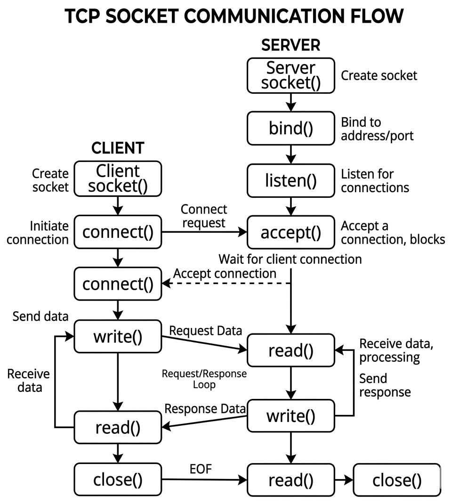
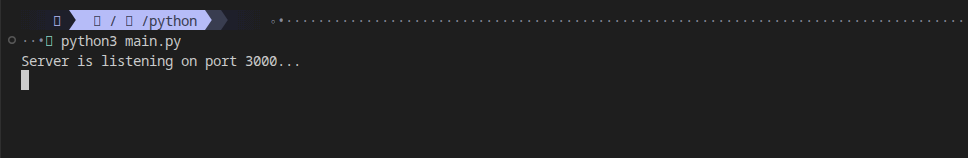
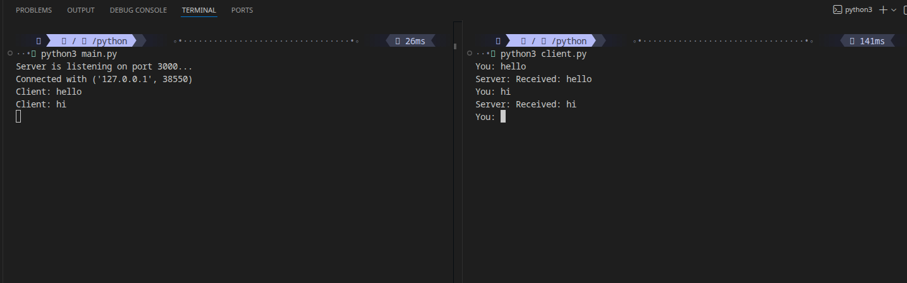
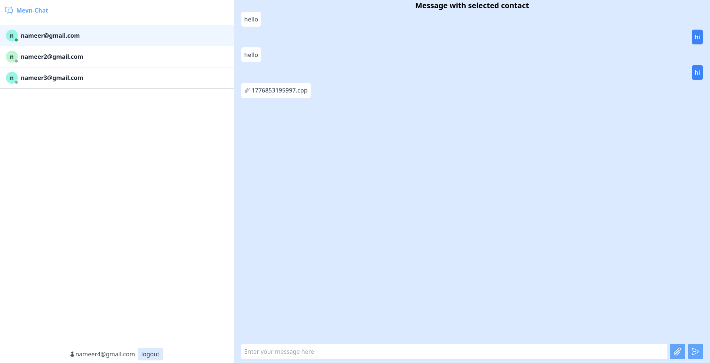
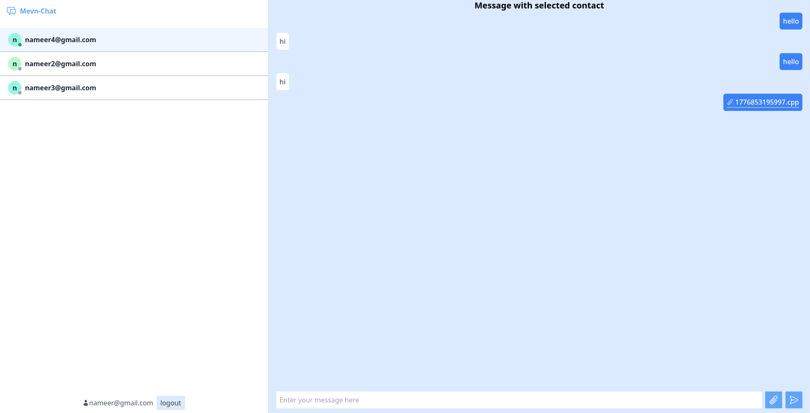

+++
title = "Socket Programming"
date = 2026-04-29
draft = false
description = "Learn what sockets are, how TCP and UDP differ, and how to build a simple client-server connection."
tags = ["networking", "socket-programming", "TCP", "UDP", "python", "websockets"]

[cover]
image = "thumbnail.jpeg"
alt = "client server sockets"
+++

## Introduction
Have you ever wondered how communication between different devices happens over the internet? How do devices identify each other, and how does data find its way to the right application on the right device? All of this is made possible through sockets.


Whether you are using a chat application, playing a video game, or on a video call with a friend, all of that communication is happening via sockets under the hood.

In this blog, we will cover what sockets are, the different types of sockets,TCP and UDP,how sockets work, and a hands-on demonstration of a socket connection between a client and a server using Python.

## What Are Sockets?

Sockets are endpoints through which two systems can communicate with each other. Socket programming is the approach we use to establish and manage this communication between systems.

There are two types of sockets: **TCP sockets** and **UDP sockets**.

A socket is essentially a combination of two things:
- **IP address** — identifies the device on the network
- **Port number** — identifies the specific application running on that device

In a networked environment, two sockets are involved: a **client socket** and a **server socket**.

---

## TCP vs UDP Sockets

**TCP sockets** enable reliable communication between two processes. Data is broken into packets and transmitted across the network. If any packet is lost along the way, it is automatically retransmitted.

**UDP sockets**, on the other hand, send data packets at a higher speed than TCP. However, lost packets are not retransmitted, making UDP less reliable but faster.

### Real-World Examples

| Protocol | Examples |
|----------|----------|
| **TCP** | HTTPS (ensures all content is transferred reliably and arrives intact), FTP (guarantees files are transferred completely and without corruption) |
| **UDP** | Video streaming (minor glitches are acceptable), Online gaming (real-time updates are prioritized over reliability) |

---

## How Do Sockets Work?

In the client/server model, sockets work as follows:

1. The **server** starts up, prepares a socket (binding to an IP address and port number), and begins listening for incoming connections.
2. The **client** creates its own socket, connects to the server socket, and begins sending and receiving data.

### Real-World Example

- **Chat applications** rely on sockets to enable real-time messaging between users.



---

## WebSockets

The sockets used by browsers to communicate with a server are called **WebSockets**. They are conceptually similar to regular sockets but operate at a higher level of abstraction, making them easier to use in web-based applications.

### Why Do We Need WebSockets?

Normal HTTP connections are stateless, i.e for every piece of data, the client makes a request to the server and the server responds, which makes it unsuitable for real-time communication. WebSockets solve this problem. Once a WebSocket connection is established between a client and a server, the repeated request-response cycle is replaced by a persistent connection, allowing both sides to send and receive data at any time.

---

## Demonstration

### Server Side

The following code shows the server side implementation. It uses the `socket` package to start a service, bind it to a specific IP address and port, and begin listening for incoming data.

```python
import socket

server_socket = socket.socket()
server_socket.bind(('localhost', 3000))
server_socket.listen(1)
print("Server is listening on port 3000...")

conn, addr = server_socket.accept()
print(f"Connected with {addr}")

while True:
    data = conn.recv(1024).decode()
    if not data:
        break
    print("Client:", data)
    conn.send(f"Received: {data}".encode())

conn.close()
```



### Client Side

The following code shows the client-side implementation, which connects to the server socket and initiates communication. The server receives and processes every message sent by the client.

```python
import socket

client_socket = socket.socket()
client_socket.connect(('localhost', 3000))

while True:
    msg = input("You: ")
    client_socket.send(msg.encode())
    response = client_socket.recv(1024).decode()
    print("Server:", response)
```



### Web Sockets Demo

The following is a demonstration of a simple chat application built using Node.js WebSockets, which enables real-time communication between multiple users.





---

That's all about socket programming. Thank you so much for reading!