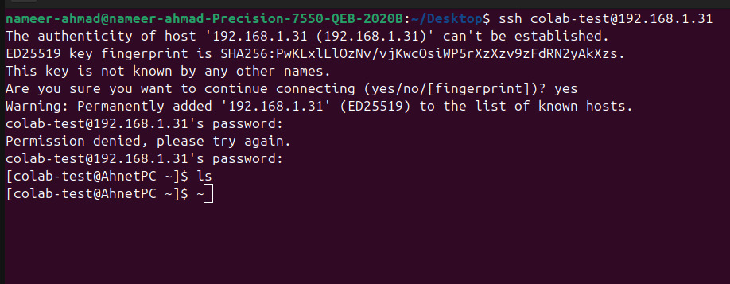
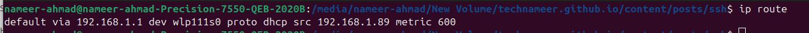
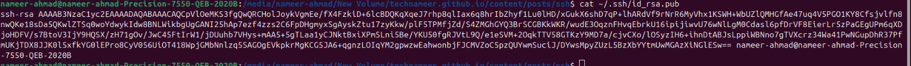

+++
title = "Getting Started With SSH"
date = 2026-01-30T12:56:01+05:00
draft = false
description = "Learn how to set up and use SSH for secure remote server access, including both password and key-based authentication methods."
tags = ["SSH", "Linux", "Security", "Server", "Tutorial"]
+++


## What is SSH?

SSH (Secure Shell) is a network protocol that allows you to access remote servers and computers securely. Through SSH, you can transfer files, run commands, and control computers and systems without physically accessing them—all with strong encryption protecting your connection.

## Why Was SSH Developed?

SSH was developed as a secure replacement for the Telnet protocol, which had a critical security flaw: all data was sent as plain text, making it extremely vulnerable to attackers who could easily intercept and read the communications. 

SSH is a **cryptographic protocol**, meaning all communication between two systems is encrypted using advanced cryptographic techniques. The data is scrambled in such a way that only the intended recipient can decrypt and access it.

## Installing SSH on Linux

To use SSH on Linux, you'll need to install OpenSSH:
```bash
sudo apt install openssh-server
```

After installation, verify that the SSH service is running and enable it to start automatically on boot:
```bash
sudo systemctl start ssh
sudo systemctl enable ssh
```

After starting the SSH service, you should see confirmation that it's active and running.

<!-- Add your screenshot here -->
<!--  -->


## Authentication Methods

There are two primary ways users can authenticate to connect to your machine via SSH:

1. **Password-based authentication**
2. **Public/private key authentication**

### Setting Up a New User

Before configuring authentication, you'll need to create a user account on your machine:
```bash
sudo adduser newusername
```

## Method 1: Password-Based Authentication

To allow users to connect using password authentication, you need to configure the SSH daemon:
```bash
sudo nano /etc/ssh/sshd_config
```

In the configuration file, find and modify these lines:
```
PasswordAuthentication yes
PermitRootLogin no
AllowUsers username
```

**Note:**
- `PasswordAuthentication yes` enables password login
- `PermitRootLogin no` disables direct root login for security
- `AllowUsers username` specifies which users can connect (replace with actual username)

After making these changes, restart the SSH service:
```bash
sudo systemctl restart ssh
```

### Connecting to the Server

Now you can connect to the server using:
```bash
ssh newusername@server_ip
```

<!-- Add your screenshot here -->


### Finding Your Server IP Address

To find your server's IP address, run:
```bash
ip route
```



Look for the line with the `src` label. This is your server's IP address.

## Method 2: Key-Based Authentication (Recommended)

Key-based authentication is more secure than password authentication. Here's how it works:

1. You create a **pair of cryptographic keys**: a private key and a public key
2. The **private key** stays securely on your local machine
3. The **public key** is copied to the server
4. When you connect, the server matches your private key with the public key
5. If they match, an encrypted SSH session is established

### Generating SSH Keys

Create a new key pair on your local machine:
```bash
ssh-keygen -t rsa -b 4096
```


This creates a 4096-bit RSA key pair for maximum security.

### Copying the Public Key to the Server

Use the following command to automatically copy your public key to the server:
```bash
ssh-copy-id user@server_ip
```

Alternatively, you can manually view your public key with:
```bash
cat ~/.ssh/id_rsa.pub
```


### Configuring SSH for Key-Based Authentication

Edit the SSH configuration file:
```bash
sudo nano /etc/ssh/sshd_config
```

Modify these lines to enable key authentication and disable password authentication:
```
PasswordAuthentication no
PubkeyAuthentication yes
```

Restart the SSH service to apply changes:
```bash
sudo systemctl restart ssh
```

### Connecting with Key Authentication

Now you can connect to the server without entering a password:
```bash
ssh user@server_ip
```

The authentication happens automatically using your private key!

## Conclusion

SSH is an essential tool for secure remote system administration. While password authentication is simpler to set up, key-based authentication provides stronger security and is the recommended approach for production environments. Always remember to disable root login and carefully manage which users have SSH access to your systems.

---